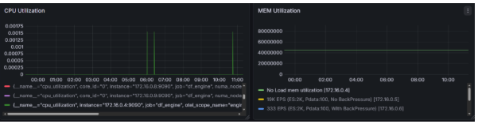
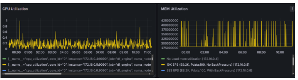
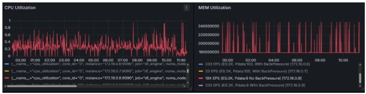
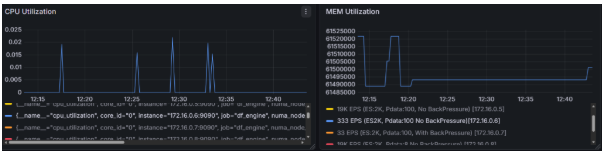
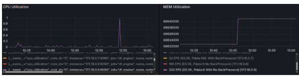

# Otel-Arrow Benchmark results on windows platform
# df_engine Memory Under Load on windows platform: Experiment Report 

## Objective 

Investigate the memory behavior of `df_engine` (a Rust-based OpenTelemetry 

dataflow engine) on windows platform, compiled with mimalloc allocator, under  

high-volume log ingestion via `telemetrygen`. 

## Test Setup 

**Pltform**: These perf tests are performed under azure windows VMs. 

Image: Windows Server 2022 DataCenter Azre Edition - x64 Gen2 

Size: Standard_D2s_v6 (2vcpu, 8G Mem) 

**Pipeline**: OTLP gRPC receiver → batch processor → noop exporter 

**Load generator**: `telemetrygen logs` from `opentelemetry-collector-contrib`, 

generating ~2 KB log records (two ~1 KB attribute strings per record), batched   

in groups of 100 (the default `--batch-size`). 

**Engine**: `df_engine` release build from latest main branch of oel-arrow repo
compiled with with mimalloc allocator, `--num-cores 1`. 

Build Command: cargo build --release --bin df_engine --features mimalloc --workspace 

**Metrics**: Prometheus pull exporter at `http://127.0.0.1:9090/metrics`. 

**Common telemetrygen command**: 

```PowerShell 

Telemetrygen.exe logs \ 

  --otlp-endpoint localhost:4317 --otlp-insecure \ 

  --rate <> --duration 30s --workers N \ 

  --telemetry-attributes 'key1="<~1KB>"' \ 

  --telemetry-attributes 'key2="<~1KB>"' 

``` 

## Part 1: Memory Behavior Under No Load 

**Config** (`otlp-batch-noop.yaml`): 

- `channel_capacity.pdata: 128` 

- `max_concurrent_requests`: auto (defaults to pdata capacity = 128) 

- Batch: `otlp.min_size: 65536` (64 KB), `flush_timeout: 3s` 

**df_engine start Command** Start-Process -Filepath "df_engine.exe" -ArgumentList "--config .\configs\otlp-batch-noop.yaml --num-cores 1" -WindowStyle hidden 

**Result** 

    Mem Utilization:~46M, CPU Utilization: < 0.002% 

 


## Part 2: Memory Behavior Under Load 

A. Perf Behavior with high EPS(~19K/s) with no client backpressure 

### Standard config (pdata=128, no wait) 

**Config** (`otlp-batch-noop.yaml`): 

- `channel_capacity.pdata: 128` 

- `max_concurrent_requests`: auto (defaults to pdata capacity = 128) 

- Batch: `otlp.min_size: 65536` (64 KB), `flush_timeout: 3s` 

**df_engine start Command** Start-Process -Filepath "df_engine.exe" -ArgumentList "--config .\configs\otlp-batch-noop.yaml --num-cores 1" -WindowStyle hidden 

**Load Generatio**

While ($True) { 

telemetrygen logs --otlp-endpoint localhost:4317 --otlp-insecure --rate 18856 --duration 30s --workers 10 --telemetry-attributes 'key1="<~1KB>"' -telemetry-attributes 'key2="<~1KB>"' 

} 

- EPS: 6285 E/S 

**Result**:

Mem Utilization=285 MB(Stable) 423 MB(PEAK) 

CPU Utilization: 0.4%(Stable), 1%(PEAK)



### Low-memory config (pdata=8, no wait) 

**Config** (`otlp-batch-noop-lowmem.yaml`): 

- `channel_capacity.pdata: 8` 

- `max_concurrent_requests: 8` 

- Batch: `otlp.min_size: 32768` (32 KB), `flush_timeout: 1s` 

**df_engine start Command** Start-Process -Filepath "df_engine.exe" -ArgumentList "--config .\configs\otlp-batch-noop-lowmem.yaml --num-cores 1" -WindowStyle hidden

**Load Generation** 

  While ($True) { 

  telemetrygen logs --otlp-endpoint localhost:4317 --otlp-insecure --rate 18856 --duration 30s --workers 10 --telemetry-attributes 'key1="<~1KB>"' -telemetry-attributes 'key2="<~1KB>"' 

  } 

  - EPS: 6285 E/S 

**Result**: 

Mem Utilization=180 MB(Stable) 240 MB(PEAK) 

CPU Utilization: 0.4%(Stable), 1%(PEAK) 




B. Perf Behavior with EPS(111E/s) with client backpressure 

### Standard config (pdata=128, wait) 

**Config** (`otlp-batch-noop-waitresult.yaml`): 

- `channel_capacity.pdata: 128` 

- wait_for_result: true on gRPC receiver 

- `max_concurrent_requests`: auto (defaults to pdata capacity = 128) 

- Batch: `otlp.min_size: 65536` (64 KB), `flush_timeout: 3s` 

**df_engine start Command** Start-Process -Filepath "df_engine.exe" -ArgumentList "--config .\configs\otlp-batch-noop-waitresult.yaml --num-cores 1" -WindowStyle hidden

**Load Generation**

  While ($True) { 

  telemetrygen logs --otlp-endpoint localhost:4317 --otlp-insecure --rate 333 --duration 30s --workers 10 --telemetry-attributes 'key1="<~1KB>"' -telemetry-attributes 'key2="<~1KB>"' 

  } 

  - EPS: 111 E/S 

**Result**: 

Mem Utilization=62 MB(Stable) 62 MB(PEAK) 

CPU Utilization: 0.02% 




### Low-memory config (pdata=8, reduced batch, No back pressure) 

**Config** (`otlp-batch-noop-lowmem.yaml`): 

- `channel_capacity.pdata: 8` 

- `max_concurrent_requests: 8` 

- Batch: `otlp.min_size: 32768` (32 KB), `flush_timeout: 1s` 

**df_engine start Command** Start-Process -Filepath "df_engine.exe" -ArgumentList "--config .\configs\otlp-batch-noop-waitresult.yaml --num-cores 1" -WindowStyle hidden

**Load Generation** 

  While ($True) { 

  telemetrygen logs --otlp-endpoint localhost:4317 --otlp-insecure --rate 333 --duration 30s --workers 10 --telemetry-attributes 'key1="<~1KB>"' -telemetry-attributes 'key2="<~1KB>"' 

  } 

  --EPS: 111 E/S 

**Result**: 

Mem Utilization=70 MB(Stable) 70 MB(PEAK) 

CPU Utilization: 0.02%(Stable), 1%(Peak) 


 